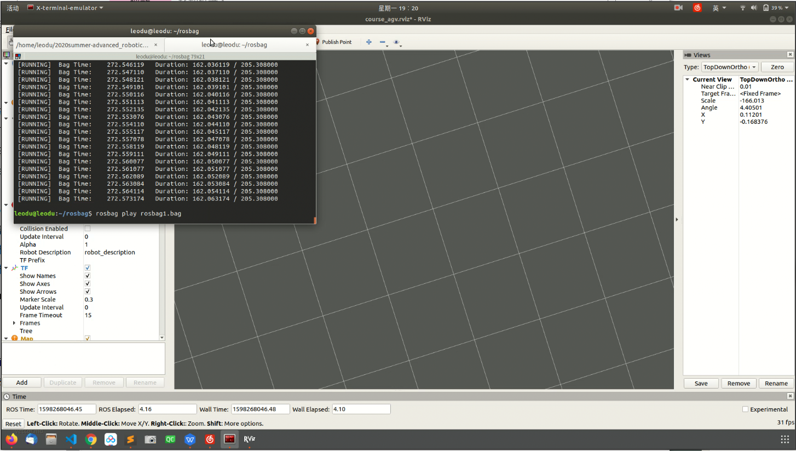
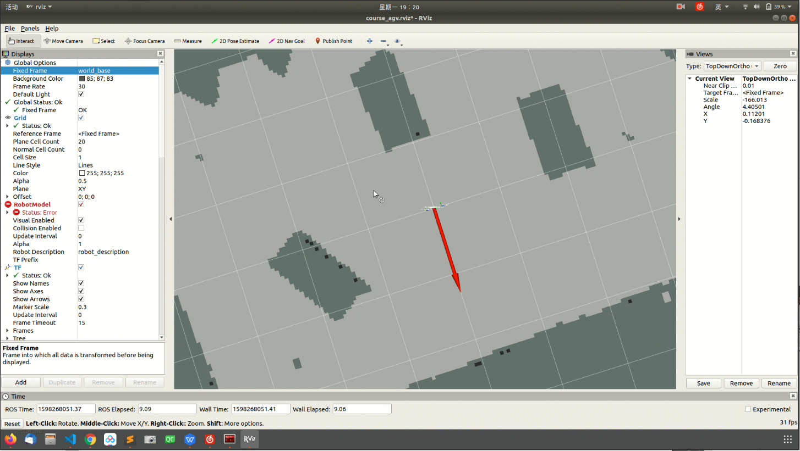
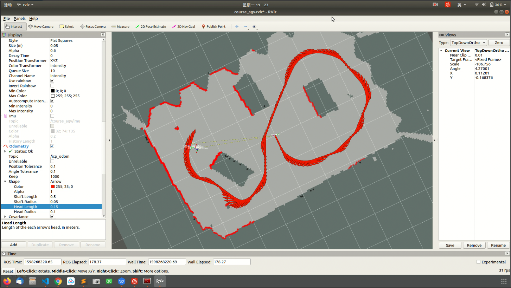
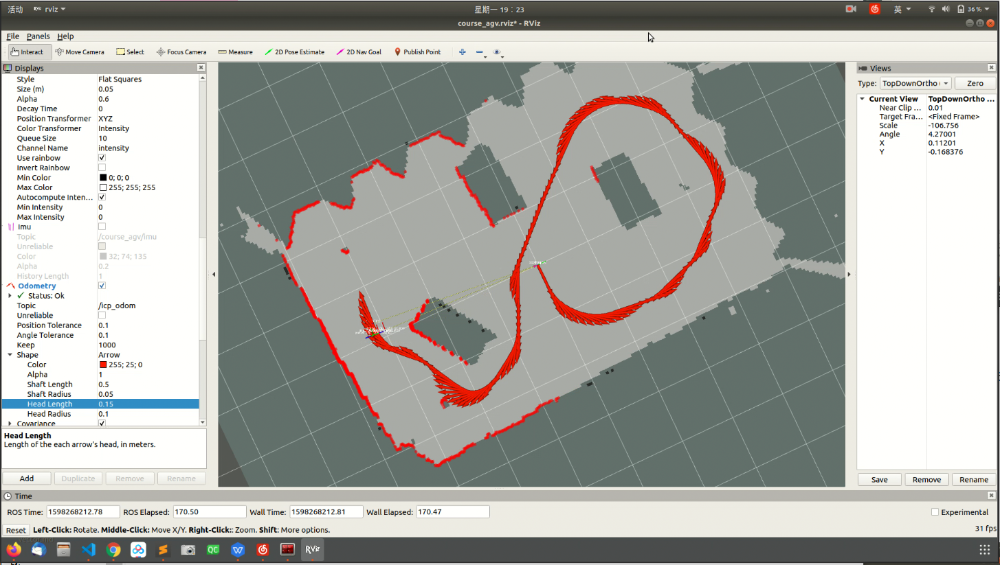
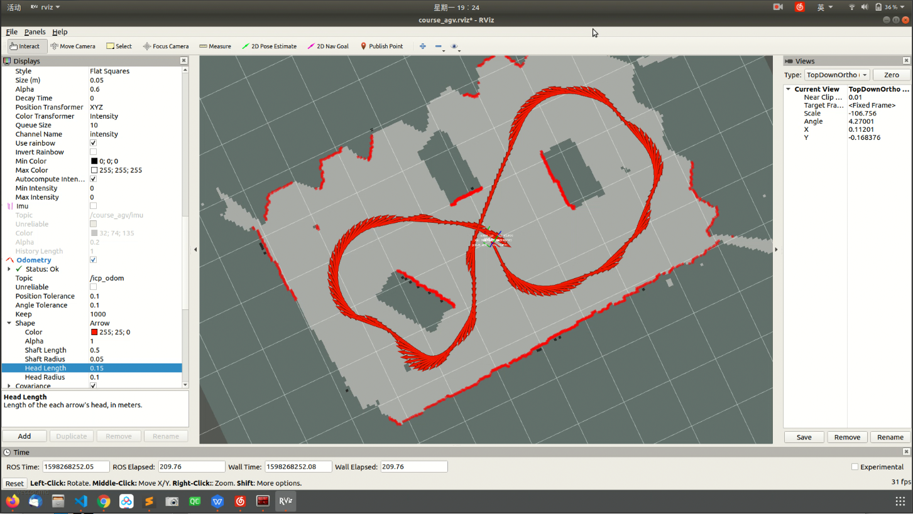
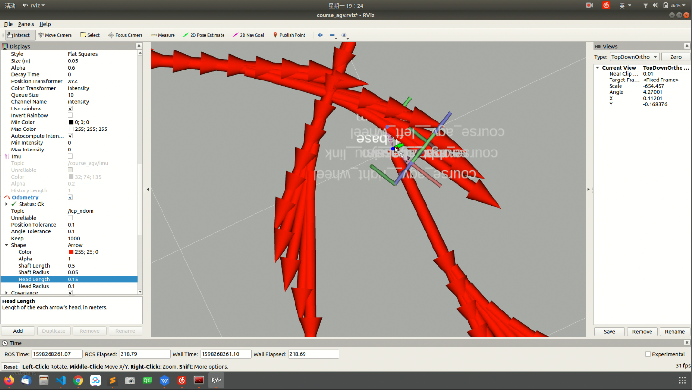

# 机器人学强化训练 里程估计实践报告

## 一、里程估计方法简介

由于本次实验中agv小车配备高精度的激光雷达传感器，因此本次里程估计任务我们主要借助激光数据和icp算法实现小车运动的里程估计，并在基本icp算法上做一定改进，借助滤波提高icp算法精准度。积累运动中积攒的激光点云数据，通过变换得到点云地图。


## 二、程序设计说明

程序结构设计：

```bash
├── course_agv_icp
│   ├── CMakeLists.txt
│   ├── launch
│   │   ├── course_agv.rviz
│   │   └── icp.launch
│   ├── package.xml
│   └── scripts
│       ├── icp.cpp
│       ├── tf.cpp
```

icp.cpp中只有一个icp类，下面结合代码对icp类中重要函数进行说明

```C++
class icp{

public:

    icp(ros::NodeHandle &n);
    ~icp();
    ros::NodeHandle& n;

    // robot init states
    double robot_x;
    double robot_y;
    double robot_theta;
    // sensor states = robot_x_y_theta
    Vector3d sensor_sta;
      
    // max iterations
    int max_iter;
    // distance threshold for filter the matching points
    double dis_th;
    // tolerance to stop icp
    double tolerance;
    // if is the first scan, set as the map/target
    bool isFirstScan;
    // src point cloud matrix
    MatrixXd src_pc;
    // target point cloud matrix
    MatrixXd tar_pc;
    
    // used for point cloud calc
    pcl::PointCloud<pcl::PointXYZ> cloud;
    Eigen::Matrix3d PtTransform;
    void addVecToCloud(Eigen::MatrixXd moved_pc);

    // ICP process function
    void process(sensor_msgs::LaserScan input);
    // transform the ros msg to Eigen Matrix
    Eigen::MatrixXd rosmsgToEigen(const sensor_msgs::LaserScan input);
    // fint the nearest points & filter
    NeighBor findNearest(const Eigen::MatrixXd &src, const Eigen::MatrixXd &tar);
    // get the transform from two point sets in one iteration
    Eigen::Matrix3d getTransform(const Eigen::MatrixXd &A, const Eigen::MatrixXd &B);
    // calc 2D Euclidean distance
    float calc_dist(const Eigen::Vector2d &pta, const Eigen::Vector2d &ptb);
    // transform vector states to matrix form
    Eigen::Matrix3d staToMatrix(const Vector3d sta);

    // ros-related subscribers, publishers and broadcasters
    ros::Subscriber laser_sub;
    void publishResult(Matrix3d T);
 	tf::TransformBroadcaster odom_broadcaster;
 	ros::Publisher odom_pub;
};
```


```C++
Eigen::MatrixXd rosmsgToEigen(const sensor_msgs::LaserScan input);
```

将传感器读到的角度与距离数据转换为机器人局部坐标系下的x,y坐标数据


```C++
NeighBor findNearest(const Eigen::MatrixXd &src, const Eigen::MatrixXd &tar);
```

对两帧点云图进行匹配，并实现滤波


```C++
float calc_dist(const Eigen::Vector2d &pta, const Eigen::Vector2d &ptb);
```

计算两点间欧氏距离


```C++
Eigen::Matrix3d staToMatrix(const Vector3d sta);
```

将3 * 1向量[tx, ty, theta]转换为对应2维平面中3*3齐次变换矩阵


**重点实现函数**：

```C++
Eigen::Matrix3d icp::getTransform(const Eigen::MatrixXd &src, const Eigen::MatrixXd &tar)
```

传入参数：getTransform函数读取两个点集矩阵src 和 tar。src为原始点集，tar为目标点集。src和tar结构均为：每行为点集中一个点在机器人局部坐标系下坐标（x, y），列数不限，代表传入需要匹配的点集中点数，src和tar列数应保持一致。

返回值：getTransform函数返回一个``Eigen::Matrix3d`` 的3x3 仿射变换矩阵，其结构为：

```
[Rstar2d tstar2d
 0   0      1   ]
```

其中Rstar2d为平面上2x2旋转矩阵，tstar2d为平面2x1位移向量

设src中点为p', tar中点为p，则应有``Rstar2d, tstar2d ∈ argmin ∑||p -  (Rstar2d * p' + tstar2d)||²``

算法实现：

根据线性代数知识，优化问题``Rstar2d ∈ argmin ∑||p -  (Rstar2d * p' + tstar2d)||²``可用以下算法解决：

1. 求出两组点集质心位置：p_src和p_tar
2. 求出两组点集的去心坐标矩阵：demean_src和demean_tar
3. 令 W = demean_src^T * demean_tar
4. 对W做奇异值分解 W = USV^T
5. 则上述优化问题中Rstar2d = V * U^T
6. tstar2d = p_tar - Rstar2d * p_src


## 三、程序设计优化改进

对于助教所给的Bonus部分，我们进行了以下尝试：

### 1. 滤波算法

pcl库当中提供了许多自带的滤波函数

```C++
#include<pcl/filters/passthrough.h>  //直通滤波器头文件
#include<pcl/filters/voxel_grid.h>  //体素滤波器头文件
#include<pcl/filters/statistical_outlier_removal.h>   //统计滤波器头文件
#include <pcl/filters/conditional_removal.h>    //条件滤波器头文件
#include <pcl/filters/radius_outlier_removal.h>   //半径滤波器头文件
```

考虑到本次实验中点云分布的性质，这里尝试采用统计滤波器对激光感应器采集到的点进行过滤，考虑到离群点的特征，则可以定义某处点云小于某个密度，既点云无效。计算每个点到其最近的k个点平均距离。则点云中所有点的距离应构成高斯分布。给定均值与方差，可剔除3∑之外的点。

```C++
pcl::PointCloud<pcl::PointXYZ>::Ptr cloud(new pcl::PointCloud<pcl::PointXYZ>);
for (int i = 0; i < src.size(); i++)
  {
    cloud->points[i].x = src[0,i];
    cloud->points[i].y = src[1.i];
    cloud->points[i].z = 0;
  }
  pcl::PointCloud<pcl::PointXYZ>::Ptr cloud_after_StatisticalRemoval(new pcl::PointCloud<pcl::PointXYZ>);//
  pcl::StatisticalOutlierRemoval<pcl::PointXYZ> Statistical;
  Statistical.setInputCloud(cloud);
  Statistical.setMeanK(20);//取平均值的临近点数
  Statistical.setStddevMulThresh(5);//临近点数数目少于多少时会被舍弃
  Statistical.filter(*cloud_after_StatisticalRemoval);
```

这里将前一帧的点云在寻找最近邻之前进行过滤，得到的结果与后一帧进行匹配，实现剔除离群点的功能。


### 2. 点云地图构建

**2.1 点云库的使用：**

1. pcl库安装

2. icp.cpp中包含头文件：

    ```C++
    #include <pcl/io/pcd_io.h>
    #include <pcl/point_types.h>
    #include<pcl/PCLPointCloud2.h>
    #include <pcl/point_cloud.h>
    #include<pcl/visualization/cloud_viewer.h>
    #include<pcl/visualization/pcl_visualizer.h>
    ```

3. CMakeLists的添加：

    ```
    find_package( PCL REQUIRED COMPONENT  common io filters)
    FIND_PACKAGE( PCL REQUIRED COMPONENTS common io visualization)include_directories(${PCL_INCLUDE_DIRS})
    ```

4. CMakeLists的修改：

   ```
   target_link_libraries(tf
   ${catkin_LIBRARIES}
   ${PCL_LIBRARIES}
   )
   ```


**2.2 点云图的输出**：

思路：在icp类中新增cloud成员用以储存点云地图，每次做icp迭代后记录其次变换矩阵，并与历史记录的变换矩阵累乘，得到从机器人初始位姿到当前位姿的齐次变换矩阵，将当前激光点云数据逆变换至初始位姿处，每个icp迭代循环中进行上述过程即可。

代码实现：

在icp::process()末尾添加如下代码：

```C++
//Point Cloud map building
Eigen::MatrixXd moved_pc = PtTransform * src_pc;
addVecToCloud(moved_pc);
PtTransform = PtTransform * Transform_acc;
```

其中addVecToCloud函数：

```C++
void icp::addVecToCloud(Eigen::MatrixXd moved_pc){
    pcl::PointXYZ point;
    for(int i = 0; i < moved_pc.row(0).size(); i++){
        point.x = moved_pc(0, i);
        point.y = moved_pc(1, i);
        point.z = 0;git@github.com:LeoDuhz/Advanced_Robotics.git
        cloud.push_back(point);
    }
}
```


## 四、实验结果讨论

**利用rosbag测试icp算法**

```C++
$ roslaunch course_agv_icp icp.launch
//另开终端
$ rosbag play ****.bag
```

rviz中可见地图上显示出红色箭头表示icp的里程估计结果，与机器人局部坐标原点对比得到误差


运行course_agv.rviz，开始播放录制的rosbag




在rviz中，Global Options -> Fixed Frame改为world_base，程序将icp算法所计算的当前速度和方向显示在地图上




半途时，可见误差很小，icp里程估计测算路径与机器人实际经过路线基本吻合


在经过该处时里程估计误差稍有增大，主要原因是该点附近能见的障碍物和边界点较少，因此激光数据点较少，造成icp算法误差增大




对比滤波前程序在此处的误差，可以观察到由于滤波将两帧之间无法对应的点去掉，因此提高了icp算法的精准度，误差降低




路程结束回到起点，此时由于激光可见的障碍物点增多，icp精准度增高




最终里程估计误差放大图，可以看到误差已接近0



