# 机械臂部分实验报告


## 实验1：正逆运动学

### 正运动学

#### 1.实验原理与公式

所用的原理就是改进的Denavit-Hartenberg参数，D-H参数包括连杆长度、连杆转角、连杆偏距、关节角，通过对Probot Anno机械臂的D-H参数进行求取，然后利用相关的公式，构造出齐次变换矩阵，完成正运动学的求解。

公式如下：


然后进行累乘计算：
$$
{_6^0\!T}  = {_1^0\!T}{_2^1\!T}{_3^2\!T}{_4^3\!T}{_5^4\!T}{_6^5\!T}
$$
通过得到的齐次变换矩阵，就可以从中读出或者计算出末端的位姿。

具体计算过程如下：
$$
x = {_6^0\!T}(1,4),\ y={_6^0\!T}(2,4),z={_6^0\!T}(3,4)\\
roll=arccos({_6^0\!T}(3,3)/cos(pitch))   \\
pitch=arcsin(-{_6^0\!T}(3,1))\\
yaw=arcsin({_6^0\!T}(2,1)/cos(pitch))
$$


#### 2.详细实验步骤

1.通过Probot Anno机械臂的尺寸图和实物，对机械臂求解D-H参数，具体求解建系和D-H参数结果如下：

|  i   | alpha(i-1) | a(i-1) | theta(i) | d(i) |
| :--: | :--------: | :----: | :------: | :--: |
|  1   |     0      |   0    |    theta1    | 0.284 |
|  2   | pi/2 | 0 | pi/2+theta2 | 0 |
|  3   | 0 | 0.225 | theta3 | 0 |
|  4   | pi/2 | 0 | theta4 | 0.2289 |
|  5   | -pi/2 | 0 | -pi/2+theta5 | 0 |
|  6   | pi/2 | 0 | theta6 | 0.055 |
|  7   | -pi/2 | 0 | 0 | 0 |

2.编写程序进行求解

以C++文件为例，借助Eigen库，编写了DK正运动学类，其中包括成员变量（6个关节变量）和两个成员函数计算相关矩阵运算。部分代码如下：

```c++
class DK{
   public:
       Eigen::MatrixXd calDK();
       Eigen::MatrixXd calT(double alpha, double a, double d, double w);
       double w[6]{0};
};

Eigen::MatrixXd DK::calDK()
{
    Eigen::MatrixXd T = Eigen::MatrixXd::Identity(4,4);

    T =  T * calT(0,0,0.284,this->w[0]);
    T = T * calT(pi/2,0,0,pi/2+this->w[1]);
    T = T * calT(0,0.225,0,this->w[2]);
    T = T * calT(pi/2,0,0.2289,this->w[3]);
    T = T * calT(-pi/2,0,0,-pi/2+this->w[4]);
    T = T * calT(pi/2,0,0.055,this->w[5]);
    T = T * calT(-pi/2,0,0,0);

    return T;
}
```

其中DK类中成员变量w存储六个关节变量并初始化为0，calDK()函数为计算正运动学的主要函数，calT()函数计算每一次的齐次变换矩阵，在main函数中求解出x,y,z,roll,pitch,yaw


#### 3.实验结果分析

对于要求的两组正运动学计算，这里验证如下：

第一组：[0.927, -0.687, -0.396, 0, 1.083, 0.927]

输入rostopic pub /probot_anno/arm_pos_controller/commanstd_msgs/Float64MultiArray "data: [0.927, -0.687, -0.396, 0, 1.083, 0.927]

机械臂运动到如下位置：


通过gazebo读出：


通过C++程序求解验证：


通过MATLAB程序求解验证：


可以看出，误差基本在十万分位，求解的误差非常小。


第二组：[0.322, -0.855, -0.021, 0, 0.877, 0.322]

输入rostopic pub /probot_anno/arm_pos_controller/commanstd_msgs/Float64MultiArray "data: [0.322, -0.855, -0.021, 0, 0.877, 0.322]

机械臂运动到如下位置：


通过gazebo读出：


通过C++程序求解验证：

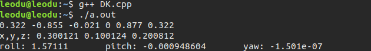

通过MATLAB程序求解验证：


第二组的求解验证依然保持高精度，误差在十万分位左右。


综上，正运动学部分效果很好，误差在10^(-5)以下，非常精确。


### 逆运动学

#### 1.实验原理与公式

逆运动学要求输入初始位置和角度共6个参数，在gazebo中默认角度表示为XYZ固定角，而通过机器人参数解算出能够到达该位姿的可能解，由于实验用的机器人均为旋转关节，最后需要解出6个关节角度。常见的方法有几何法和解析法，我们这里采用了全解析法去求解机械臂六个关节的关节变量。

首先需要对输入进行处理，将其转化为齐次变换矩阵 ${_6^0\!T}$，具体变换形式如下，设输入为: x,y,z,c,b,a
$$
{_6^0\!T}=\begin{bmatrix}
cos(a)*cos(b)&cos(a)*sin(b)*sin(c)-sin(a)*cos(c)&cos(a)*sin(b)*cos(c)+sin(a)*sin(c)&x\\
sin(a)*cos(b)&sin(a)*sin(b)*sin(c)+cos(a)*cos(c)&sin(a)*sin(b)*cos(c)-cos(a)*sin(c)&y\\
-sin(b)&cos(b)*sin(c)&cos(b)*cos(c)&z\\
0&0&0&1
\end{bmatrix}
=\begin{bmatrix}
r11&r12&r13&x\\
r21&r22&r23&y\\
r31&r32&r33&z\\
0&0&0&1
\end{bmatrix}
$$
​                                      

这个变换矩阵中所有参数都是已知的，接下来需要用未知角度列出6个旋转关节的变换矩阵，如下所示,未知角度设为${\theta{_1}}$,${\theta{_2}}$,${\theta{_3}}$,${\theta{_4}}$,${\theta{_5}}$,${\theta{_6}}$。  

d1,a2,d4,d6为机器人已知参数
$$
{_1^0\!T}=\begin{bmatrix}
cos\theta{_1}&-sin\theta{_1}&0&0\\
sin\theta{_1}&cos\theta{_1}&0&0\\
0&0&1&d1\\
0&0&0&1
\end{bmatrix}

{_2^1\!T}=\begin{bmatrix}
cos\theta{_2}&-sin\theta{_2}&0&0\\
0&0&-1&0\\
sin\theta{_2}&cos\theta{_2}&0&0\\
0&0&0&1
\end{bmatrix}

{_3^2\!T}=\begin{bmatrix}
cos\theta{_3}&-sin\theta{_3}&0&a2\\
sin\theta{_3}&cos\theta{_3}&0&0\\
0&0&1&0\\
0&0&0&1
\end{bmatrix}
\\
{_4^3\!T}=\begin{bmatrix}
cos\theta{_4}&-sin\theta{_4}&0&a2\\
0&0&-1&-d4\\
sin\theta{_4}&cos\theta{_4}&0&0\\
0&0&0&1
\end{bmatrix}

{_5^4\!T}=\begin{bmatrix}
cos\theta{_5}&-sin\theta{_5}&0&0\\
0&0&1&0\\
-sin\theta{_5}&-cos\theta{_5}&0&0\\
0&0&0&1
\end{bmatrix}

{_6^5\!T}=\begin{bmatrix}
cos\theta{_6}&-sin\theta{_6}&0&0\\
0&0&-1&-d6\\
sin\theta{_6}&cos\theta{_6}&0&0\\
0&0&0&1
\end{bmatrix}
$$


接下来用解析法求解6个关节角度。

首先求解${\theta{_1}}$,观察由未知角度组成的矩阵$_6^1\!T$
$$
_6^1\!T=_2^1\!T*_3^2\!T*_4^3\!T*_5^4\!T*_6^5\!T
$$
观察到
$$
_6^1\!T(2,3)=cos\theta{_5}*sin\theta{_4}\\
_6^1\!T(2,4)=cos\theta{_5}*sin\theta{_4}*d6
$$
其比值为已知定值参数d6，而由已知参数组成的$_6^0\!T$也可以通过左乘仅含$\theta{_1}$的变换矩阵的逆矩阵得到$_6^1\!T$

$$
_6^1\!T=(_1^0\!T)^{-1}*_6^0\!T\\
_6^1\!T(2,3)=cos\theta{_1}*r23-sin\theta{_1}*r13\\
_6^1\!T(2,4)=cos\theta{_1}*y-sin\theta{_1}*x
$$
因此有

$$
d6=\frac{cos\theta{_1}*y-sin\theta{_1}*x}{cos\theta{_1}*r23-sin\theta{_1}*r13}\\
\theta{_1}=atan(\frac{d6*r23-y}{d6*r13-x})
$$


接下来求${\theta{_3}}$，观察由未知角度组成的矩阵$_5^1\!T$
$$
_5^1\!T=_2^1\!T*_3^2\!T*_4^3\!T*_5^4\!T
$$
观察到其中两项平方和可以化简成仅含$\theta{_3}$的形式

$$
_5^1\!T(1,4)=cos\theta{_2}*a2+d4*sin(\theta{_2}+\theta{_3})\\
_5^1\!T(3,4)=sin\theta{_2}*a2-d4*cos(\theta{_2}+\theta{_3})\\
{(cos\theta{_2}*a2+d4*sin(\theta{_2}+\theta{_3}))}^2+{(sin\theta{_2}*a2-d4*cos(\theta{_2}+\theta{_3}))}^2={a2}^2+{d4}^2+2*a2*d4*sin\theta{_3}
$$
再将已知参数的$_6^0\!T$变换成$_5^1\!T$
$$
_5^1\!T=(_1^0\!T)^{-1}*_6^0\!T*(_6^5\!T)^{-1}\\
_5^1\!T(1,4)=cos\theta{_1}*x+sin\theta{_1}*y-d6*r13*cos\theta{_1}-d6*r23*sin\theta{_1}\\
_5^1\!T(3,4)=z-d1-d6*r33\\
$$
其中参数均为已知量，因此有
$$
\theta{_3}=asin(\frac{(cos\theta{_1}*x+sin\theta{_1}*y-d6*r13*cos\theta{_1}-d6*r23*sin\theta{_1})^2+(z-d1-d6*r33)^2-a2^2-d4^2}{2*a2*d4})
$$


下面求解$\theta{_2}$，观察由未知角度组成的矩阵$_5^0\!T$，观察到
$$
_5^0\!T(3,4)=d1+sin\theta{_2}*a2-d4*cos(\theta{_2}+\theta{_3})
$$
再将已知参数的$_6^0\!T$变换成$_5^0\!T$
$$
_5^0\!T=_6^0\!T*(_6^5\!T)^{-1}\\
_5^0\!T(3,4)=z-d6*r33
$$
因此联立求解
$$
(d4*sin\theta{_3}+a2)*sin\theta{_2}-d4*cos\theta{_3}*cos\theta{_2}=z-d6*r33-d1
$$
这里需要配凑角来辅助解出结果，设为$\alpha$
$$
\alpha=acos(\frac{d4*sin\theta{_3}+a2}{\sqrt{(d4*sin\theta{_3}+a2)^2+(d4*cos\theta{_3})^2}})\\
sin(\theta{_2}-\alpha)=\frac{z-d6*r33-d1}{\sqrt{(d4*sin\theta{_3}+a2)^2+(d4*cos\theta{_3})^2}}\\
\theta{_2}=asin(\frac{z-d6*r33-d1}{\sqrt{(d4*sin\theta{_3}+a2)^2+(d4*cos\theta{_3})^2}})+\alpha
$$
下面求解$\theta{_5}$，观察由未知角度组成的矩阵$_6^3\!T$，观察到
$$
_6^3\!T(2,3)=-cos\theta{_5}
$$
再将已知参数的$_6^0\!T$变换成$_6^3\!T$
$$
_6^3\!T=(_1^0\!T*_2^1\!T*_3^2\!T)^{-1}*_6^0\!T\\
_6^3\!T(2,3)=r33*cos(\theta{_2}+\theta{_3})-r23*sin\theta{_1}*sin(\theta{_2}+\theta{_3})-r13*cos\theta{_1}*sin(\theta{_2}+\theta{_3})
$$
因此有
$$
\theta{_5}=acos(r23*sin\theta{_1}*sin(\theta{_2}+\theta{_3})+r13*cos\theta{_1}*sin(\theta{_2}+\theta{_3})-r33*cos(\theta{_2}+\theta{_3}))
$$
下面求解$\theta{_4}$和$\theta{_6}$，观察由未知角度组成的矩阵$_6^1\!T$，观察到
$$
_6^1\!T(2,3)=cos\theta{_5}*sin\theta{_4}
$$
再将已知参数的$_6^0\!T$变换成$_6^1\!T$
$$
_6^1\!T=(_1^0\!T)^{-1}*_6^0\!T\\
_6^1\!T(2,3)=cos\theta{_1}*r23-sin\theta{_1}*r13
$$
因此
$$
\theta{_4}=asin(\frac{cos\theta{_1}*r23-sin\theta{_1}*r13}{cos\theta{_5}})
$$
在观察上述$_6^1\!T$，观察到存在恒等式
$$
-(r11*cos\theta{_1}*sin(\theta{_2}+\theta{_3})+r21*sin\theta{_1}*sin(\theta{_2}+\theta{_3})-r31*cos(\theta{_2}+\theta{_3}))=cos\theta{_6}*sin\theta{_5}\\
r12*cos\theta{_1}*sin(\theta{_2}+\theta{_3})+r22*sin\theta{_1}*sin(\theta{_2}+\theta{_3})-r32*cos(\theta{_2}+\theta{_3})=sin\theta{_6}*sin\theta{_5}
$$
将其上下相比有
$$
\theta{_6}=atan(\frac{r12*cos\theta{_1}*sin(\theta{_2}+\theta{_3})+r22*sin\theta{_1}*sin(\theta{_2}+\theta{_3})-r32*cos(\theta{_2}+\theta{_3})}{-(r11*cos\theta{_1}*sin(\theta{_2}+\theta{_3})+r21*sin\theta{_1}*sin(\theta{_2}+\theta{_3})-r31*cos(\theta{_2}+\theta{_3}))})
$$

至此六个角度都通过解析法解出。


#### 2.详细实验步骤

1.首先，推导出了上述的求解六个角度的解析公式。

2.然后，我们分别用MATLAB和C++进行了实现。

以C++的IK.cpp文件为例，我们通过上面的求解6个角度的公式，用程序语言进行实现，同时结合机械臂的参数表，把不再机械臂各关节工作空间内的点排除在外，即可完成逆运动学的全部过程。

具体为定义了IK类，类中的成员变量和成员函数分别储存变换矩阵和各个角度计算的结果，通过在main函数中定义IK类的对象，赋予成员变量初值，调用calT06和cal_theta成员函数进行逆运动学的求解。

```c++
class IK{
public:
    double x = 0, y = 0, z = 0, c = 0, b = 0, a = 0; //x,y,z,roll,pitch,yaw
    Eigen::Matrix4d T06;    //齐次变换矩阵
    Eigen::MatrixXd Tt;
    double d6 = 0.055, d1 = 0.284, a2 = 0.225, d4 = 0.2289;   //关键的DH参数
    void calT06();  //由输入的x,y,z,roll,pitch,yaw计算齐次变换矩阵
    Eigen::MatrixXd cal_theta();  //逆运动学计算6个关节角度
    int check_angular(double w, double a, double b);  //检查关节角度是否在机械臂的参数要求范围内
 };
```


#### 3.实验结果分析

**逆运动学实验验证，通过MATLAB和C++程序计算以下两组末端位姿对应的关节角度。**

**第一组：[0.2, 0.2, 0.2007,1.57, -1.57, 0]**

（注：这里为了方便清晰显示结果，只输出了可行解，可行不可行加起来所有解有很多，不再一一显示）

MATLAB:

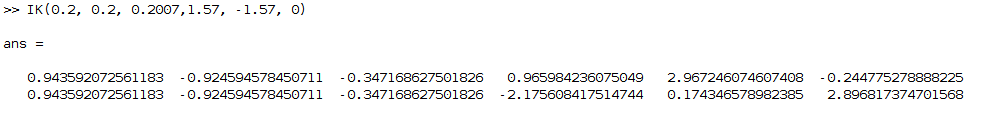

C++:

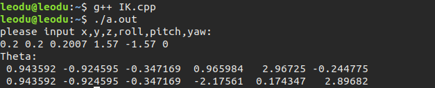

将得到的逆运动学结果反代回gazebo仿真实验环境，验证解算的正确性：

```bash
rostopic pub /probot_anno/arm_pos_controller/commanstd_msgs/Float64MultiArray "data: [0.943592072561183,-0.924594578450711,-0.347168627501826,0.965984236075049,2.967246074607408,-0.244775278888225]"
```

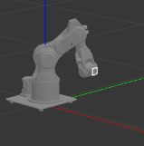

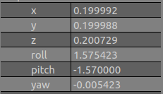


```bash
rostopic pub /probot_anno/arm_pos_controller/commanstd_msgs/Float64MultiArray "data: [0.943592072561183,-0.924594578450711,-0.347168627501826,-2.175608417514744,0.174346578982385,2.896817374701568]"
```

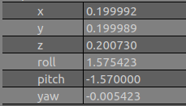


第二组：[0.15 ,0.2, 0.2007, 0, 0, 0]

MATLAB:

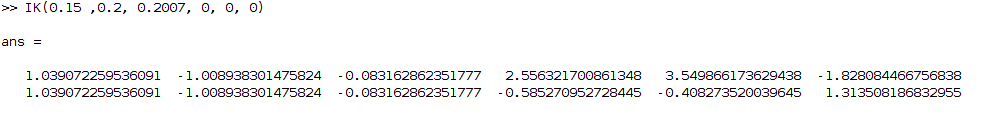

C++:

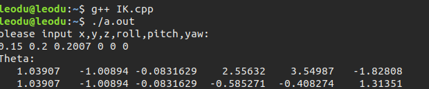


将得到的逆运动学结果反代回gazebo仿真实验环境，验证解算的正确性：

```bash
rostopic pub /probot_anno/arm_pos_controller/command std_msgs/Float64MultiArray "data:[1.039072259536091,-1.008938301475824,-0.083162862351777,2.556321700861348,3.549866173629438,-1.828084466756838]"
```

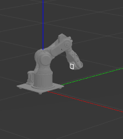

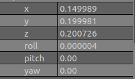


```bash
rostopic pub /probot_anno/arm_pos_controller/commanstd_msgs/Float64MultiArray "data: [1.039072259536091,-1.008938301475824,-0.083162862351777,-0.585270952728445,-0.408273520039645,1.313508186832955]"
```

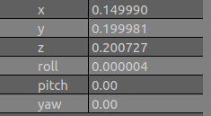

综上，可以看出，逆运动学求解的结果比较精确，一组精度在十万分位左右，一组大部分精度在十万分位，两个角度精度在千分位。


## 实验2：速度传递实验

### 1.实验原理与公式

因为可以看到Probot Anno机械臂全部为旋转关节，所以可以利用雅可比方法求解末端的线速度和角速度，也可以已知末端的线速度和角速度，求解六个关节的速度。

具体方法如下：

可以定义笛卡尔速度矢量，关节空间角速度矢量，然后构建等式。
$$
v_N=\sum{_{i=1}^N}v_N^{(i)}\\
w_N=\sum{_{i=1}^N}w_N^{(i)}\\
suppose,{\bf v_N}=\begin{bmatrix}
v_N\\w_n
\end{bmatrix}\\
suppose,{\bf\dot\theta} =\begin{bmatrix}
\dot\theta_1\\
\dot\theta_2\\
\dot\theta_3\\
\dot\theta_4\\
\dot\theta_5\\
\dot\theta_6\\
\end{bmatrix}\\
{\bf v_N}=\begin{bmatrix}
\hat Z_1 \times (P_N-P_1) \quad \hat Z_2\times(P_N-P_2) \quad...\quad \hat Z_{N-1}\times(P_N-P_{N-1})\quad0\\
\hat Z_1\quad\hat Z_2\quad...\quad\hat Z_{N-1}\quad\hat Z_N
\end{bmatrix}={\bf J(\theta)\dot \theta}\\
{\bf\dot \theta}={\bf J(\theta)^{-1}}{\bf v_N}
$$
通过上面的公式就可以从末端的线速度和角速度得到六个关节的角速度矢量。


### 2.详细实验步骤

1.编写C++程序

在trajectory_planning.cpp文件中我们进行了实现，具体过程如下：

我们定义了Anno_robot类：

```c++
class Anno_robot{
public:
	Anno_robot(Eigen::MatrixXd DHparam);  //构造函数，初始化DH参数
	~Anno_robot() {};
	Eigen::VectorXd getJointState();  //得到此刻的关节角的关节变量的值
	void setEndVelocity(Eigen::VectorXd); //传入末端线速度、角速度，进行速度传递求解
	Eigen::MatrixXd getJacobian();  //计算雅可比矩阵
	Eigen::MatrixXd calcTransform(double a, double b, double d, double o); //根据输入的DH参数计算其次变换矩阵
	void printParam();  //将最终机械臂末端位姿输出在终端
	static double timestep;  //求解的时间步长
	Eigen::VectorXd joint_velocity;  //6个关节的角速度矢量

private:
	Eigen::MatrixXd DHparam;  //DH参数
	Eigen::VectorXd end_velocity;  //笛卡尔速度矢量
};
```

这个类中有三个比较重要的成员变量，那就是DH参数，它会随着机械臂的运动而发生改变，对我们求解雅可比矩阵非常重要；end_velocity是末端的线速度、角速度，这是我们求解的已知条件；joint_velocity是关节空间中机械臂6个关节的角速度矢量。

这个类中定义了许多成员函数，主要是calcTransform由输入的DH参数计算齐次变换矩阵，getJacobian由瞬时的机械臂各关节位置姿态计算雅可比矩阵，setEndVelocity将此时的机械臂末端线速度、角速度传入，并进行雅可比矩阵求解，然后用这个矩阵的逆乘以笛卡尔速度矢量，得到我们想要的关节空间角速度矢量，同时用0.02s的时间步长更新机械臂的姿态，并且通过/probot_anno/arm_vel_controller/command话题对于仿真环境中的机械臂进行控制，发布速度的频率为50Hz，并且在最后求解完成之后，将最后机械臂末端位姿输出在终端中，便于我们去比较。

在主函数中，通过分段函数的形式表示机械臂末端的线速度和角速度，并创建了Anno_robot类的对象，调用setEndVelocity成员函数，以0.02s的步长进行求解。


2.在仿真中进行实现，验证结果的合理性和正确性

详见下一部分实验结果分析。


### 3.实验结果分析

将速度指令发到gazebo仿真环境中，让机械臂运动，最终机械臂运动到了如下位置：


读取gazebo中的机械臂末端x,y,z,roll,pitch,yaw数据:

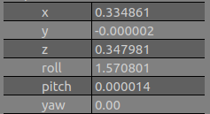

而通过程序计算得到的机械臂末端的位置为：


仿真和理论计算的绝对误差为：
$$
|x-x'|+|y-y'|+|z-z'|+|roll-roll'|+|pitch-pitch'|+|yaw-yaw'| \approx 0.000156
$$
可以看出，绝对误差非常小，说明速度传递计算的比较成功。

在附件中也附上了机械臂运动的仿真环境的视频，可以看出非常丝滑流畅。


## 实验3：点到点轨迹规划

#### 1. 实验原理与公式

点到点轨迹规划实验中，在位置坐标（0.28,-0.24,0.08）处放置一个铃铛，需要通过轨迹规划算法，使机械臂从初始状态平滑的运动到铃铛处完成敲铃。

采用关节空间规划方法，具体步骤如下：

- 通过逆运动学解算出笛卡尔空间中坐标位置（0.28,-0.24,0.08）对应的关节空间坐标
- 对每个关节变量独立进行规划，考虑到轨迹光滑性需求，这里采用三次多项式进行插值规划，计算出每个关节变量对应的三次多项式的4个系数
- 在仿真中，不断读取6个关节当前时刻轨迹对应速度，并发送速度指令，控制机械臂到达目标位姿


#### 2. 详细实验步骤

C++语言对以上算法过程实现：

- **调用函数实现**

  - 三次插值多项式系数计算函数

    ```C++
    //Interpolation: p = a0 + a1 * t + a2 * t^2 + a3 * t^3
    //arg: init_p, final_p, init_v, final_v, period
    //return: [a0, a1, a2, a3]
    Eigen::VectorXd pathInterpolation3(double init_p, double final_p, double init_v, double final_v, double period);
    ```

    **参数：**`init_p`初位置、`final_p`末位置、`init_v`初速度、`final_v`末速度、`period`时间间隔

    **算法：**函数计算出符合4个初始条件的三次插值多项式p = a0 + a1 * t + a2 * t^2 + a3 * t^3的系数：[a0, a1, a2, a3]

    **返回值：**Eigen::VectorXd型向量 [a0, a1, a2, a3]

  - 机械臂关节空间速度计算函数

    ```C++
    Eigen::VectorXd calcVel(Eigen::MatrixXd theta_t, double t);
    ```

    **参数：**

    `theta_t`: 6 * 4矩阵，每行存放对应一个关节空间位置插值多项式p = a0 + a1 * t + a2 * t^2 + a3 * t^3的系数	[a0, a1, a2, a3]

    `t`: 欲计算速度的时刻

    **返回值：**Eigen::VectorXd型向量，返回各关节在t时刻的速度，即 v = a1 + 2 * a2 * t + 3 * a3 * t^2

  

- **主函数中轨迹规划任务的实现**

  - 逆运动学解算出目标点对应关节空间坐标

    ```C++
    // End Joint State
    Eigen::VectorXd end_joint_state(6);
    end_joint_state << -0.708536, -1.44723, 0.565107, -0.000952057, 0.882642, -0.707801;
    ```

  - 对每个关节变量独立进行规划，调用`pathInterpolation3`函数计算出每个关节变量对应的三次多项式的4个系数，并存放在6*4矩阵joint_state_interp_param中，此处选择t = 10s，即10s到达目标位姿

    ```C++
    // for each joint state theta, theta = a0 + a1 * t + a2 * t^2 + a3 * t^3
    // joint_state_interp_param stores the interpolation parameters a0, a1, a2, a3
    // one row for one joint_state theta
    Eigen::MatrixXd joint_state_interp_param(6,4);
    for (int i = 0; i < 6; i++){
    joint_state_interp_param.block <1, 4>(i, 0) = pathInterpolation3(0, end_joint_state(i), 0, 0, 10).transpose();
    }
    ```

  - 启动ros节点后每隔0.02s调用一次`calVel`函数读取速度，并发布给每个关节


#### 3. 实验结果分析

运行trajectoryplanning.cpp，观察gazebo仿真环境中机械臂到点情况符合预期


# 实验4：团队敲铃考核

> 由于直接在实物机械臂上运行并调试代码有一定危险性，可能对机械臂造成损伤或对人产生威胁，因此我们团队首先在gazebo仿真环境中对敲铃过程进行实现，验证算法正确性，其次再连接实物机械臂进行测试并根据实际情况调节参数，以将实物机械臂发生未预期运动的可能性降至最低。此报告分为仿真部分与实物测试部分

## 仿真部分

#### 1. 实验原理与公式

- 实验内容与要求分析

  机械臂末端从初始门位置开始运动，绕开中间障碍物到达蓝色铃铛处敲响铃铛后，返回中间点M，然后再去敲响红色铃铛，做快速的往复的敲铃运动。在100s时间内敲铃次数多的小组，得分越高。

  分析此实验要求可知，平时实验3点到点轨迹规划中的`pathInterpolation3` 函数即可满足从起始点到蓝色铃铛，从蓝色铃铛到M，再从M到红色铃铛的运动，循环该过程即可完成任务。但如此做的一个问题是:`pathInterpolation3` 函数会让机械臂在初末位置均停下，而根据实验要求，在中间点M是不必要停下的，这样会减慢全程平均速度，因此考虑在该函数的基础上，再实现一个从蓝色到红色，中间经过M点过程的函数`pathInterp3WithMidpoint`，使得blue到M和M到red的多项式在中间点M处速度和加速度连续

- 具体实现思路

  - 逆运动学解算出笛卡尔空间中blue, middle, red三点对应的关节空间坐标
  - 调用`pathInterpolation3` 函数解算出起点到blue的各关节三次插值多项式系数
  - 调用`pathInterp3WithMidpoint`函数解算出blue到M、M到red、red到M、M到blue的多项式，使得在M处速度和加速度连续
  - 控制机械臂从起点到blue：每隔timestep=0.02s通过`calVel`获取一次速度并发送
  - 控制机械臂在blue和red之间循环：每隔timestep=0.02s通过`calVel`获取一次速度并发送，注意每次循环需要判断目前处于4个状态中的哪一种，向`calVel`函数中输入对应参数


#### 2. 详细实验步骤

C++语言对以上算法过程实现：

- 调用函数实现

  - 三次插值多项式系数计算函数

    ```C++
    //Interpolation: p = a0 + a1 * t + a2 * t^2 + a3 * t^3
    //arg: init_p, final_p, init_v, final_v, period
    //return: [a0, a1, a2, a3]
    Eigen::VectorXd pathInterpolation3(double init_p, double final_p, double init_v, double final_v, double period);
    ```

    同轨迹规划实验中函数，见实验三报告

  - 机械臂关节空间速度计算函数

    ```C++
    Eigen::VectorXd calcVel(Eigen::MatrixXd theta_t, double t);
    ```

    同轨迹规划实验中函数，见实验三报告

  - 具有中间点的三次插值多项式系数计算函数

    ```C++
    //Interpolation with midpoint: p = a0 + a1 * t + a2 * t^2 + a3 * t^3
    //arg: init_p, mid_p, final_p, init_v, final_v, whole_period
    //return: [a10, a11, a12, a13
    //         a20, a21, a22, a23]
    MatrixXd pathInterp3WithMidpoint(double init_p, double mid_p, double final_p, double whole_period);
    ```

    参数：`init_p`初位置、`mid_p`中间位置、`final_p`末位置、`init_v`初速度、`final_v`末速度、`whole_period`时间间隔

    返回值：Eigen::MatrixXd型2*4矩阵，[a10, a11, a12, a13; a20, a21, a22, a23]，第一行和第二行分别对应`init_p`到`mid_p`，和`mid_p`到`final_p`的多项式插值系数，两段时间相同，为 `whole_period / 2`

- 主函数实现

  - 逆运动学解算出笛卡尔空间中blue, middle, red三点对应的关节空间坐标

    ```C++
    VectorXd midpoint_joint_state(6);
    midpoint_joint_state << 0.000115258, -1.15935, 0.450616, -0.00104892, 0.708735, 0.000797974;
    
    //blue ball 0.26 0.15 0.08
    VectorXd blueball_joint_state(6);
    blueball_joint_state << 0.523405, -1.28345, 0.0903509, -0.00186839, 1.1927, 0.525141;
    
    //red ball 0.28 -0.24 0.08
    VectorXd redball_joint_state(6);
    redball_joint_state << -0.708536, -1.44723, 0.565107, -0.000952057, 0.882642, -0.707801;
    
    ```

  - 调用`pathInterpolation3` 函数解算出起点到blue的各关节三次插值多项式系数；调用`pathInterp3WithMidpoint`函数解算出blue到M、M到red、red到M、M到blue的多项式，使得在M处速度和加速度连续

    ```C++
    MatrixXd start2blue_joint_state_interp_param(6,4); // the coeffients of the joint state interpolation polynomial from start to blue ball
    MatrixXd blue2mid_joint_state_interp_param(6,4);
    MatrixXd mid2red_joint_state_interp_param(6,4);
    MatrixXd red2mid_joint_state_interp_param(6,4);
    MatrixXd mid2blue_joint_state_interp_param(6,4);
    
    // calculate the coefficients of the interpolation polynomials
    for (int i = 0; i < 6; i++){
        start2blue_joint_state_interp_param.block <1, 4>(i, 0) = pathInterpolation3(0, blueball_joint_state(i), 0, 0, timeperiod_s2b).transpose();
        blue2mid_joint_state_interp_param.block <1, 4>(i, 0) = pathInterp3WithMidpoint(blueball_joint_state(i), midpoint_joint_state(i), redball_joint_state(i), timeperiod_r2b).block <1,4>(0,0);
        mid2red_joint_state_interp_param.block <1, 4>(i, 0) = pathInterp3WithMidpoint(blueball_joint_state(i), midpoint_joint_state(i), redball_joint_state(i), timeperiod_r2b).block <1,4>(1,0);
        red2mid_joint_state_interp_param.block <1, 4>(i, 0) = pathInterp3WithMidpoint(redball_joint_state(i), midpoint_joint_state(i), blueball_joint_state(i), timeperiod_r2b).block <1,4>(0,0);
        mid2blue_joint_state_interp_param.block <1, 4>(i, 0) = pathInterp3WithMidpoint(redball_joint_state(i), midpoint_joint_state(i), blueball_joint_state(i), timeperiod_r2b).block <1,4>(1,0);
    }
    ```

  - 控制机械臂从起点到blue：每隔timestep=0.02s通过`calVel`获取一次速度并发送

    ```C++
    //from start point to reaching blue ball for the first time
    double t = 0.0;
    const double timestep = 0.02;
    VectorXd vel(6);
    while (ros::ok()){
    if (t >= timeperiod_s2b)  break;
    
    vel = calcVel(start2blue_joint_state_interp_param, t);
    
    spd_msg.data.at(0) = vel(0);
    spd_msg.data.at(1) = vel(1);
    spd_msg.data.at(2) = vel(2);
    spd_msg.data.at(3) = vel(3);
    spd_msg.data.at(4) = vel(4);
    spd_msg.data.at(5) = vel(5);
    spd_pub.publish(spd_msg);
    ROS_INFO_STREAM("published");
    
    t = t + timestep;
    loop_rate.sleep();
    }
    ```

  - 控制机械臂在blue和red之间循环：每隔timestep=0.02s通过`calVel`获取一次速度并发送，用变量`int current_state`判断目前循环所处于4个状态中的哪一种（0: blue2mid, 1: mid2red, 2: red2mid, 3: mid2blue），向`calVel`函数中输入对应参数表

    ```C++
        //back and forth between blue and red ball
        int current_state = 0; // 0: blue2mid, 1: mid2red, 2: red2mid, 3: mid2blue
        while (ros::ok()){
            for(t = 0; t <= timeperiod_r2b / 2; t += timestep, loop_rate.sleep()){
                switch(current_state){
                    case 0: 
                        vel  = calcVel (blue2mid_joint_state_interp_param, t);
                        break;
                    case 1:
                        vel  = calcVel (mid2red_joint_state_interp_param, t);
                        break;
                    case 2:
                        vel  = calcVel (red2mid_joint_state_interp_param, t);
                        break;
                    case 3:
                        vel = calcVel (mid2blue_joint_state_interp_param, t);
                        break;
                }
                spd_msg.data.at(0) = vel(0);
                spd_msg.data.at(1) = vel(1);
                spd_msg.data.at(2) = vel(2);
                spd_msg.data.at(3) = vel(3);
                spd_msg.data.at(4) = vel(4);
                spd_msg.data.at(5) = vel(5);
                spd_pub.publish(spd_msg);
                ROS_INFO_STREAM("published");
            }
            current_state += 1;
            if(current_state == 4) current_state = 0;
        }
    ```

    

#### 3. 实验结果分析

仿真敲铃测试具体见所录制视频，结果符合预期。由于仿真中物理参数与实际物理参数略有不同，因此仿真中从blue到red的时间大概设置为6s左右才不会超过仿真中速度上界，因此仿真中敲铃较慢。


## 实物部分

#### 1.实验原理与公式

实物部分的原理与公式与仿真部分基本一致，这里就不再赘述了。


#### 2.详细实验步骤

仿真与实物的主要代码差别在于参数的设置，上面一组是仿真部分的三个目标点关节角参数，下面为实物参数。

仿真

```C++
blueball_joint_state << 0.523405, -1.28345, 0.0903509, -0.00186839, 1.1927, 0.525141;
redball_joint_state << -0.708536, -1.44723, 0.565107, -0.000952057, 0.882642, -0.707801;
midpoint_joint_state << 0, -1.2, 0.45, 0, 0.8, 0;
```

实物

```C++
blueball_joint_state << 0.523405, -1.38345, 0.0903509, -0.00186839, 1.1927, 0.525141; 
redball_joint_state << -1.208536, -1.64723, 0.565107, -0.000952057, 0.882642, -0.707801;
midpoint_joint_state << -0.131790011092997, -1.212079770113469, 0.477135176977792, 0.009279848335710, 0.784490189836066, -0.138183182148361;
```

对于仿真情况来讲，三个目标点的参数完全是给定点的精确逆运动学解，中间点的位置也选取在Y轴上。这是因为仿真环境下机器人的执行能力可以得到保证，在给定时间内必然能运行到目标点。然而对于实物情况要考虑的因素就十分复杂了。

在实物测试阶段，当使用仿真的理想参数时，在机器人敲铃频率为1.8s/次（约54次）时，就已经濒临使用极限了，即精确到点能力。这是由于关节1的执行能力有限，在1.8s内能运动到的极限角度（在该速度规划下）接近两铃的转动弧度，当给出更短的运动周期时，即使关节1达到极限速度依然无法到达铃铛位置，未敲击到铃就提前返回。而在两铃位置不对称的情况下，角度更大、距离更远的红色铃铛更不易被敲到，基于这个原因我们更改了目标点的关节角度。

首先是压低所有目标点关节2的角度（第二个参数），确保每次自上而下敲击到铃铛，这是因为经常出现机械臂运动到铃铛的正上方敲不到铃的情况。接下来是更改中间点的位置，本来仿真中的中间点Y=0，而红色Y=-24，蓝色Y=15，这套参数在我们实物追求极限次数时是不太好用的，会导致碰不到红色点，因此我们将中间点Y设为-5，代入逆运动学解出关节角。这时的参数已经满足1.6s/次（约60次）的要求了。

接下来想要更进一步提高次数，主要依赖于机械臂能否敲到红色铃，本来我们打算充分利用机械臂的末端三个关节来触碰红色铃铛，但后来发现关节4、5、6的执行速度过慢（相对于1.6s/次的敲铃速度），无法在1.6s内完成末端的一定角度转动，只能放弃。这时我们考虑到机械臂的规划曲线，速度递减是与角度差有关的，当角度差较大时，从中间点到红色点在1.6s之内基本没有减速，这样才能最大程度发挥机械臂性能，于是我们加大红色铃铛的关节角度（这在仿真情况下会导致机械臂越过红色铃铛，但在实物情况下根本到达不了），使得关节1基本保持全速状态，最后突破到1.5s/次（约64次）。

最后就是不同机械臂的执行能力的区别了，我们又更换了一组性能较好的机械臂，达到了1.46s/次（约66次），可惜最后还没来得及优化从开始位置到铃铛的5s，我们预估的实验室机械臂极限大概在68次左右，这也是我们平时自行测试的极限数据，不过这样对机械臂本身损伤也比较大，运动情况也不太稳定。


#### 3.实验结果分析

其实在最后的实验过程中应该给出速度限制和加速度限制，同样也会产生敲铃次数的上限，否则对机械臂的损伤较大，也不符合控制理论的要求。后面的参数优化调整意义不是很大，因为机械臂没有返回速度或者位置的数据，整个控制过程完全开环，也无法通过负反馈使机械臂稳定、精准运行。最后测试我们完成了65次敲铃，我们认为这也比较接近这款机械臂的极限了。


